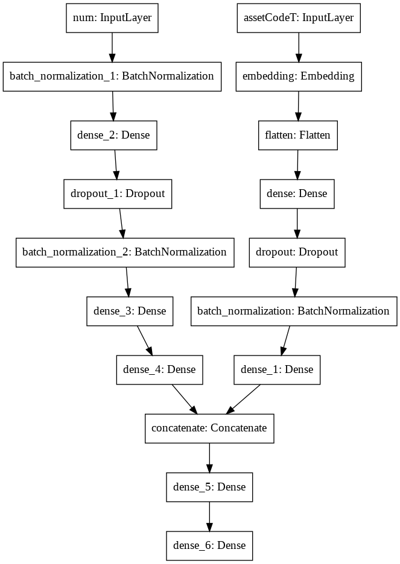
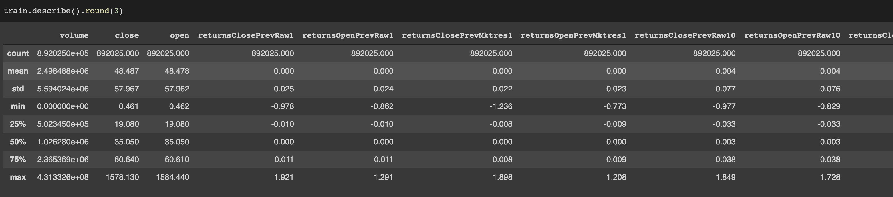
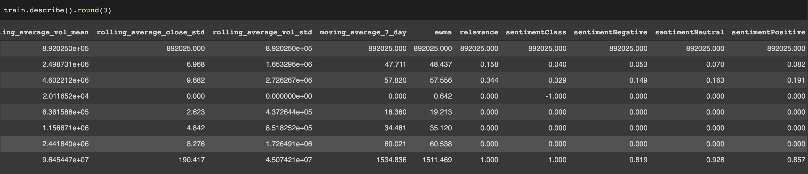

# Forecasting Stock Prices Using News Sentiment Analysis

As the title says, in this project, I try to use Market Data on Assets and Financial News to predict the movement of stock prices into the future. 10 days into the future to be exact.

	Tools: [Python, Pandas, Numpy, Keras, Tensorflow, Plotly, SKLearn]

I trained the model on [datasets](https://drive.google.com/drive/u/0/folders/1fXHjne9F5r12itMHt3HUQcfS2DIVYb6c) by Two Sigma on Kaggle. Unfortunately, they're no longer publicly available so I researched for and discovered a few previous participants and got them to share their copy. (I hope that's legal!)

The training data are in two dataframes and are described as follows:

	* Market Data (2007 to Present) - Provided by Intrinio, contains financial market information such as opening price, closing price, trading volume, calculated returns, etc.

	* News Data (2007 to Present) - Provided by Reuters, contains information about news articles/alerts published about assets, such as article details, sentiment, and other commentary.

For Exploratory Data Analysis, please see EDA.ipynb

## Summary

**Model Type:** Artificial Neural Network ( 37,717 Trainable params )

**Features used (Variable X):**

The features (total 45) are of three categories:

* Market Data Features
* Engineered Features - Rolling averages and Exponential Weighted Moving averages of Open and Close Prices
* News Data Features

Some of these features were further normalized with Scalers from SKLearn.

**Features Predicted (Variable Y):**

	returnsOpenNextMktres10(float64) - 10 day, market-residualized return.

    You must predict a signed confidence value, (-1, 1), which is multiplied by the market-adjusted return of a given assetCode over a ten day window.

## Guidelines 

As I worked on this, I maintained a two rules.

 1. **Avoid overfitting:** Financial data can easily be overfit, so my goal was to fit simpler models. Initially, I considered using non ML models like ARIMA or Holt-Winter's, but I went with a simple neural network with a high dropout probabilty (0.5) instead. This would also allow me to insert additional information from the news.

 2. **Use recent data only:** The markets are structurally unstable, so one should only operate on recent data. Thus, I only used data from 2015 onwards. (This was thanks to my mentor. He also said that I should drop the news altogether, but that would be less interesting/challenging.) 

